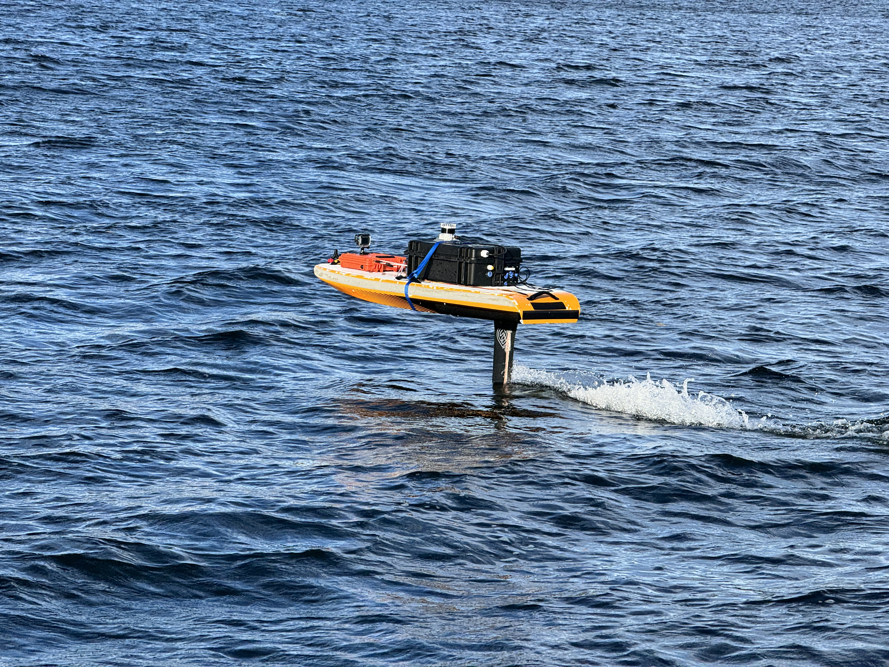
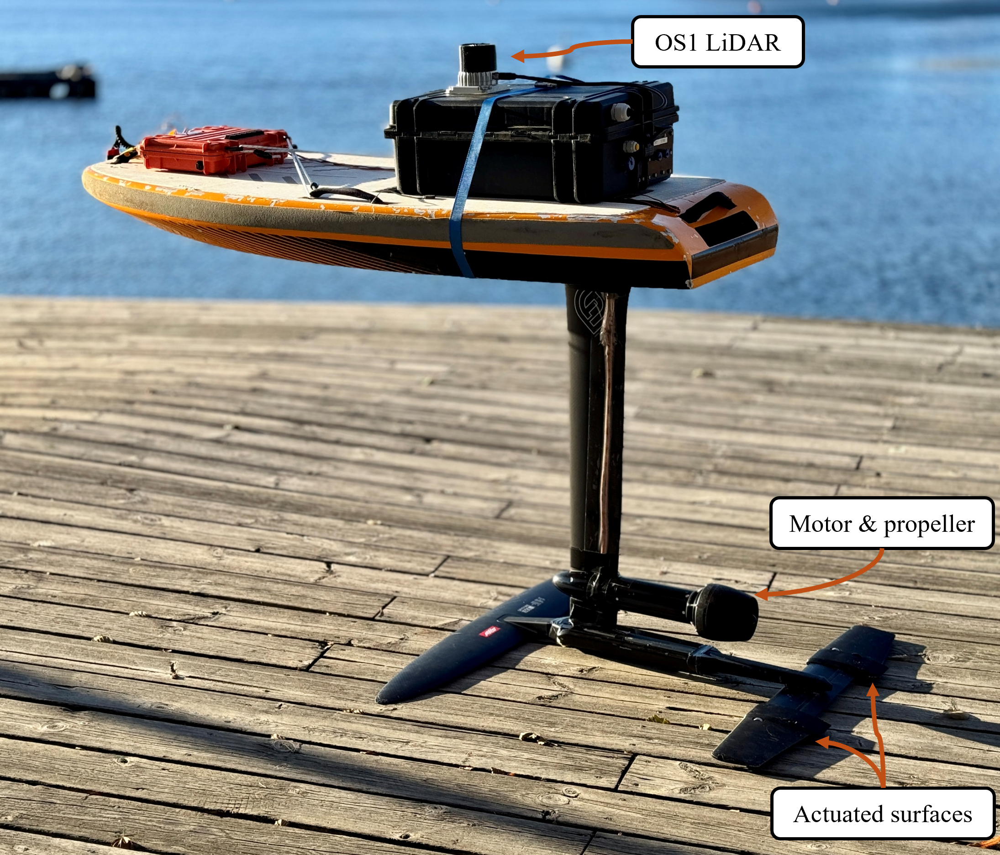
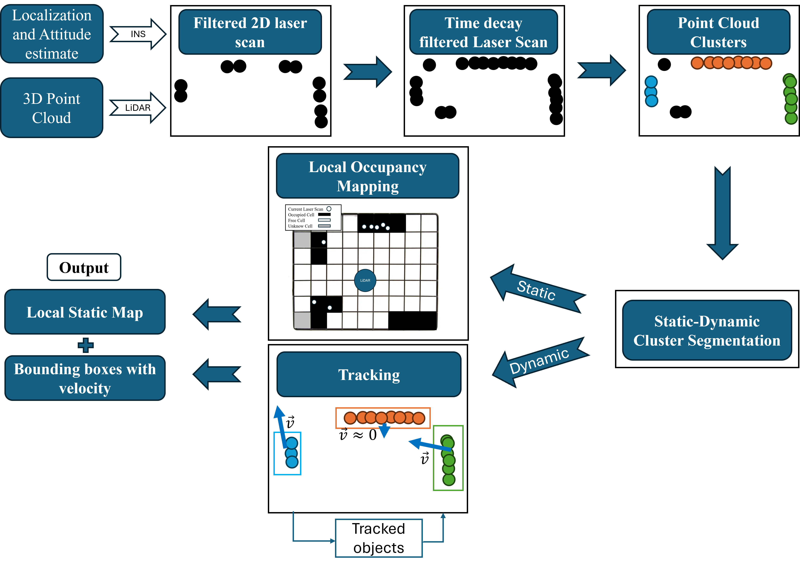
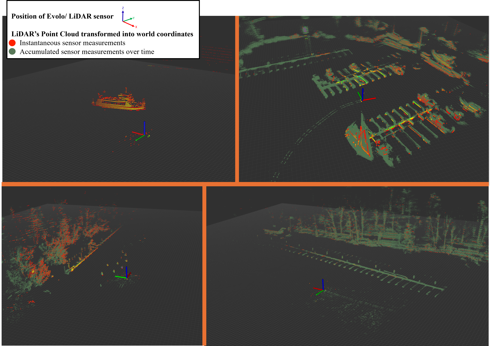
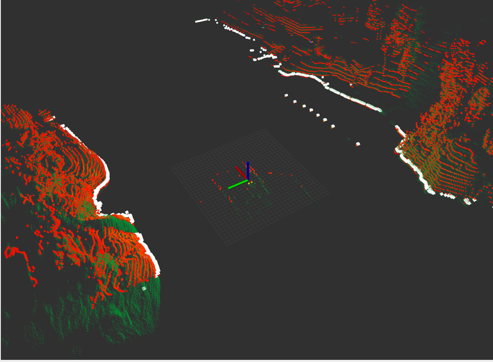
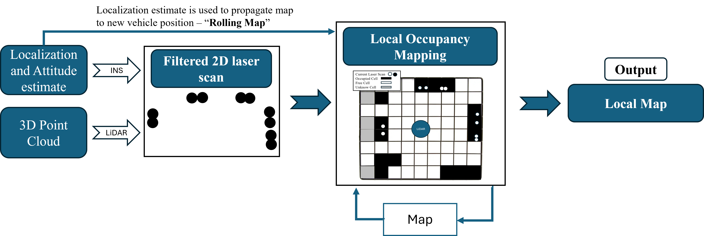
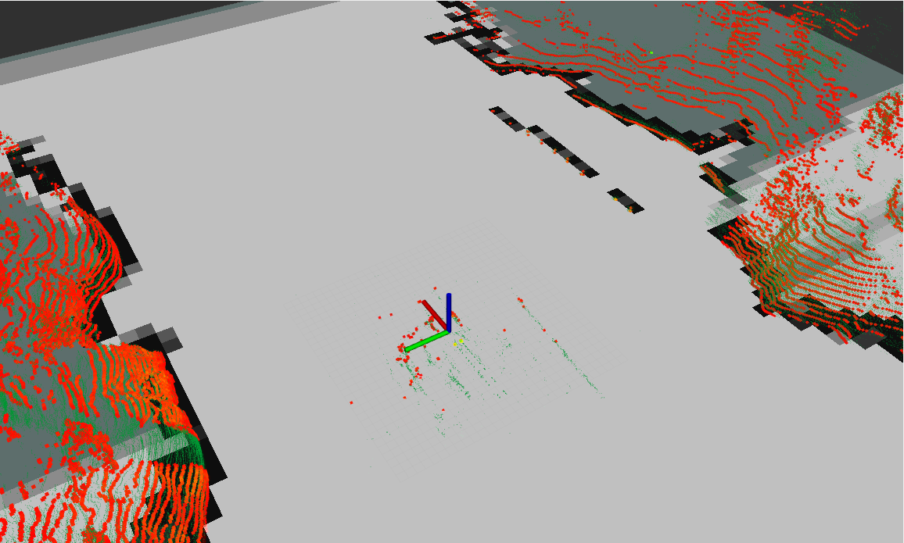
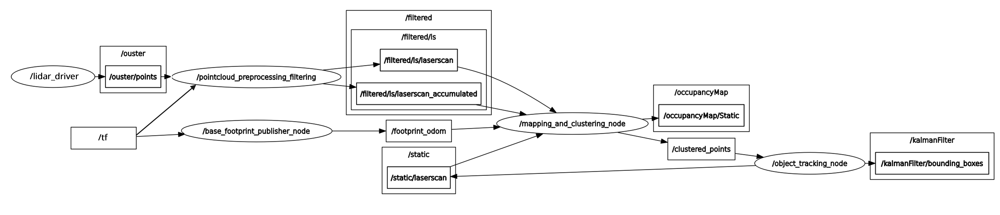

# Lidar Perception Pipeline for Hydrofoiling USV - ROS2 Humble
## Introduction
This project is an obstacle detection and tracking
framework designed for a hydrofoiling Unmaned Surface Vehicle (USV), using a LiDAR sensor and a ego-vehicle localization estimate given by an INS.
This work serves as a perception layer for a future obstacle avoidance and path planning implementation.
The project processes raw point cloud data, filters it and represents the obstacles in the environment either with an Occupancy Grid Map or a set of Bounding Boxes with a velocity estimate, or even a combination of both.
The code is integrated with ROS2 Humble, it expects to receive the appropriate Tfs and an input raw point cloud. Outputs are the filtered point cloud, marker arrays and occupancy grid maps, all published with standard ROS2 topics. Througough testing has been made to prove that the algorithm runs in real-time.

A complete  master thesis report of this project can be read here (link still missing). It includes a literature review of related scintific work, a complete explanation and justification of the chosen methods, and an analysis and discussion of results.

### Evolo Hydrofoiling USV:
The project is purposely made for a surface maritime environment, where point clouds often detect water surface reflctions. The test platform was a hydrofoiling USV called Evolo, which often reaches high Roll and Pitch angles, that were also dealt with by this perception pipeline.

  
  

### Flowchart definining high-level pipeline:
This package preprocesses raw 3D LiDAR data into a filtered 2d representation. It then creates a rolling local occupancy grid map with static obstacles and it performs multi-object tracking with dynamic obstacles. 

    

# Collected Maritime Surface Vehicle data/input

    

# Outputs:
The package outputs several representations of a filtered point cloud. 
You can choose if this filtered data is used to build a rolling local occupancy grid map, if it gets clustered and tracked with multi-object tracking. There is also an option to segment the clusters with dynamic and static labels, then tracking the dynamic clussters and building the local map with the static ones.
### LiDAR Point Cloud Filtering and Preprocessing
Preprocessing steps:
1. Transformation of the point cloud from the LiDAR sensor's frame to the vehicle's *base footprint* frame.
2. IMU-informed RANSAC to estimate the water surface plane, followed by removal of all points at or below the surface of the water.
3. Dynamic Radius Outlier Filtering.
4. Region-based pass-through filter for points too high up to be considered obstacles.
5. Data reduction from a 3D point cloud to a 2D Laser Scan.
6. Time decay: Temporal accumulation of 2D Laser Scans to construct a more complete 2D point cloud, gathered over a specified time horizon.

    

### Rolling Local Occupancy Grid Mapping 

    

  

### Multi-object tracking with Kalman Filter

    

  

### Full pipeline with static-dynamic obstacle segmentation

  

## ROS2 Integration and System Arquitecture

The implementation follows a **modular design**, where each high-level process is encapsulated within its own **ROS 2 node**. This approach enables:

- Parallel execution of nodes using multi-threading  
- Clear input-output interfaces for each node  
- Easier debugging through well-defined communication over ROS 2 topics  

The full ROS 2 node graph for the proposed pipeline (including static-dynamic segmentation) is shown below:

  

> _Node graph illustrating the modular pipeline design with static-dynamic segmentation._

The system is composed of the following main nodes:

- **`/base_footprint_publisher_node`**  
  Uses localization data from the SBG Systems INS to publish the vehicle’s `base_footprint` coordinate frame.

- **`/pointcloud_preprocessing_filtering`**  
  Transforms the raw LiDAR point cloud into the `base_footprint` frame, filters the data, and publishes several representations of the filtered point cloud.

- **`/mapping_and_clustering_node`**  
  Performs clustering on time-accumulated laser scans received via `/filtered/ls/laserscan_accumulated`. It creates a segmentation map from the filtered points (from `/filtered/ls/laserscan`), segments clusters into static or dynamic classes using this map, and routes the data accordingly. It also publishes an occupancy grid map based on the static-classified points. Odometry from the `base_footprint` frame is used to propagate the rolling occupancy maps.

- **`/object_tracking_node`**  
  Handles data association, computes 2D bounding boxes, and manages a Kalman filter for each tracked object.

# Build

    git clone https://github.com/AlexReis1313/evolo-preprocessing-pointcloud.git
    cd /evolo-preprocessing-pointcloud/
    colcon build
    source the workspace
# Run
### Lidar Preprocessing Node - essential
Takes in raw LiDAR Point CLouds in sensor frame (or base_link), filters it and outputs several 2d representations in base_footprint.
Also produces base_footprint

    ros2 launch pointcloud_preprocessing pointcloud_preprocessing_launch_evolo.py
### Clustering and local occupancy grid map

    ros2 run clustering_segmentation clustering_segmentation 
    
### Tracking

    ros2 run bb_dataass_tracking bounding_box_node_main 

### Other commands - not always used

    ros2 launch pointcloud_preprocessing mapping_launch.py
    ros2 launch lidar_cluster euclidean_spatial.launch.py topic:=/filtered/ls/pointcloud/accumulated
    
### Send lightweight occupancy grid map over MQTT
    
    ros2 run occupancy_grid occupancy_grid_mqtt
    ros2 launch str_json_mqtt_bridge waraps_bridge.launch

For alternative vehicle parameters, use one of the following options:

    ros2 launch pointcloud_preprocessing pointcloud_preprocessing_launch_boat.py
    ros2 launch pointcloud_preprocessing pointcloud_preprocessing_launch_sim.py

# Youtube examples of this Package

https://www.youtube.com/playlist?list=PLS_kAMaDCf634gqgQ6XRzQY9NJVkBzv5d

# External used code
### ROS 2 pointcloud_to_laserscan package
This reository uses the pointcloud_to_laserscan ROS 2 package that provides components to convert `sensor_msgs/msg/PointCloud2` messages to `sensor_msgs/msg/LaserScan` messages and back.
Source code can be found here https://github.com/ros-perception/pointcloud_to_laserscan 
### ROS2 ros2_occupancy_grid package
This repository adapted and used the local ocupancy grid map implementation in https://github.com/hiwad-aziz/ros2_occupancy_grid

# pointcloud <-> laserscan converter with pre-proccessing
It has the following features:
* Get the current Tf from a fixed world frame to the frame_id that publishes a PointCLoud2 message
* Publishes a frame_id from the fixed world frame that has the same x,y,z,yaw as the PointCloud2 publisher's frame_id, and null roll and pitch.
This new frame is published in sync with new Laser Scan messages. Laser Scan messages have this new frame as their frame_id.
* Converts the 3D PointCloud messages into 2D LaserScan messages. The convertion is made with several extra steps that filter the water surface and noise from the original PointCloud, in a surface maritime environment.

# Filtering Technique

In order to filter out noisy points in the PointCloud, an addaptive version of Radius Outlier Removal (ROR) is used.

To filter out reflections seen in the water, points are removed if they land in low z coordinates and have a very low intensity in the XYZI pointcloud.

In order to filter/segment out the water surface from the Point Cloud, eliminating all points below a certain height threshold makes use of the assumption that the roll and pitch estimation for the robot are correct.
When these pitch and roll estimates have an associated error, this height threshold method eliminates a lot of important sections of the PoinCloud in long-range sections.

This package exploits the fact that water/wave detection points in a PointCloud generated by a Lidar are almost only visible in a very short range from the Lidar.
This package also exploits the fact that roll and pitch angle errors do not correspond to big height errors, in low-range scenarios.
Given this, this package computes 2 LaserScans, from the original pointcloud. It then merges the 2 into a final and filtered LaserScan that is published.
The 2 computed LaserSCans are:
* Long-range LaserScan: It includes points in a big range of heights (for example: -8m to +8m), but is limited between a ´transition_range´ and a maximum range.
* Short-range LaserScan: It includes points only above a certain height threshold, up until a ´transition_range´. It also considers a minimum range (for example: 1.5m) that eliminates the points belonging to the ego-vehicle.

# Outputs

Output LaserScan:
* Merged LaserScan: Merges the 2 computed LaserScans, by only considering the minimum range measurement between the 2 for each laser beam. Topic: `scanner/scan/merged`

Output PointClouds:
* Filtered PointCloud before conversion to LaserScan - Topic: `filtered_pointcloud`
* PointCloud with same information as merged laserScan - Topic: `scanner/scan/pointcloud`

Output real-time Map:

LaserScan message that defines the range of the closest obstacle, for each angle interval (with big angle intervals in mind). This is meant to be passed as an array of ranges to a Obstacle avoidance algorithm. The data used to generate this message is the filtered and Merged LaserScan.
* Map for Obstacle avoidance algorithm: `map/radial`
* Same Map, but meant for RVIZ visualization: `map/radial/visual`

# Output visualization
* Blue: original PointCloud
* White: Merged/filtered LaserScan `scanner/scan/merged`
* Brown: Output real-time Map `map/radial/visual`

 

## pointcloud\_to\_laserscan::PointCloudToLaserScanNode

This ROS 2 component projects `sensor_msgs/msg/PointCloud2` messages into `sensor_msgs/msg/LaserScan` messages.

### Published Topics

* `scanner/scan/merged` (`sensor_msgs/msg/LaserScan`) - The output laser scan.
* `laser_scan_frame` frame in Tf tree - this is frame_id of scan

### Subscribed Topics

* `cloud_in` (`sensor_msgs/msg/PointCloud2`) - The input point cloud. No input will be processed if there isn't at least one subscriber to the `scan` topic.
* `tf` - Tf transform between a given fixed world frame and the frame_id of `cloud_in`
  
### Parameters - Specific to this package

* `fixed_frame` (str, default: none)
* `cloud_frame` (str, default: none) - Frame where pointcloud is being published on: `os_sensor`
* `min_height_longrange` (double, default: 2.2e-308) - The minimum height to sample in the long-range point cloud in meters.
* `max_height_longrange` (double, default: 1.8e+308) - The maximum height to sample in the long-range point cloud in meters.
* `min_height_shortrange` (double, default: 2.2e-308) - The minimum height to sample in the short-range point cloud in meters.
* `max_height_shortrange` (double, default: 1.8e+308) - The maximum height to sample in the short-range point cloud in meters.
* `range_transition` (double, default: 1.8e+308) - The range measurement from where the Short Range LaserScan stops and the Long Range LaserScan begins

### Parameters - Kept from original package

* `angle_min` (double, default: -π) - The minimum scan angle in radians.
* `angle_max` (double, default: π) - The maximum scan angle in radians.
* `angle_increment` (double, default: π/180) - Resolution of laser scan in radians per ray.
* `queue_size` (double, default: detected number of cores) - Input point cloud queue size.
* `scan_time` (double, default: 1.0/30.0) - The scan rate in seconds. Only used to populate the scan_time field of the output laser scan message.
* `range_min` (double, default: 0.0) - The minimum ranges to return in meters.
* `range_max` (double, default: 1.8e+308) - The maximum ranges to return in meters.
* `target_frame` (str, default: none) - Mandatory - Name of the frame that the LaserScan will be published from. 
* `transform_tolerance` (double, default: 0.01) - Time tolerance for transform lookups. Only used if a `target_frame` is provided.
* `use_inf` (boolean, default: true) - If disabled, report infinite range (no obstacle) as range_max + 1. Otherwise, report infinite range as +inf.
